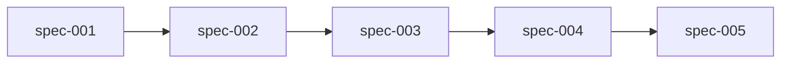

# Dependencies — LLM Wiki パターンを spec-driven 開発に適用する

## Dependency Graph

## Implementation Order

| Order | Specification | Depends On | Why This Order | Notes |
|-------|---------------|------------|----------------|-------|
| 1 | spec-001-raw-directory | none | `raw/` は最も単純な scaffolding。先に原典層を固めないと以降の仕様が参照先を持てない | `.gitkeep` と README のみの軽い spec |
| 2 | spec-002-wiki-scaffolding | spec-001 | `wiki/` は `raw/` を前提に責務分離を語る必要がある。`README.md` で raw との関係を記述するため spec-001 先行 | `index.md`、`log.md`、4 サブディレクトリを一括で bootstrap |
| 3 | spec-003-claude-md-schema | spec-002 | `CLAUDE.md` スキーマは実在する `raw/` と `wiki/` を指す必要がある。ディレクトリが存在しない状態でスキーマだけ書くと、書いた文と実体がズレる | Ingest / Query / Lint の手順を命令形で documented にする |
| 4 | spec-004-seed-ingest | spec-003 | Ingest 操作は `CLAUDE.md` の命令形手順に従って実行される。Seed は wiki 初版を作る段階 | 成果物は wiki/sources、concepts、entities、synthesis、index、log の初版 |
| 5 | spec-005-query-lint | spec-004 | Query と Lint は既存 wiki を前提に動く。Ingest 結果が揃わない状態で Query / Lint を回しても意味のあるレポートにならない | knowledge.md を記事素材として確定させる出口仕様 |

## Non-Dependencies

- `docs/architecture.md` と `README.md` の更新は各 spec の Implementation Steps に含まれる副次的タスクで、spec 間の依存関係を生成しない
- `docs/roadmap.md` の更新は PRD 作成時点で済ませるため、各 spec からは独立
