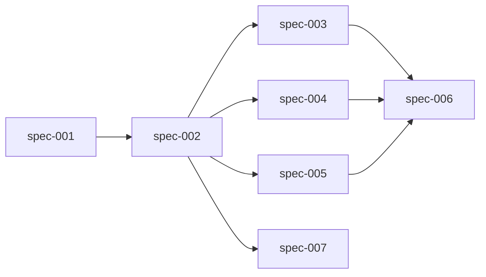

# Dependencies — Personal Agent 構想の第一歩

## Dependency Graph

## Implementation Order

| Order | Specification | Depends On | Why This Order | Notes |
|-------|---------------|------------|----------------|-------|
| 1 | spec-001-nextjs-app-scaffold | none | personal-agent/ のベースがないと以降が置けない | Vercel 接続まで含む |
| 2 | spec-002-supabase-schema | spec-001 | DB とデータ層がないと以降の UI 実装の受け皿がない | goals / metrics / actuals の 3 テーブル、Auth、RLS |
| 3 | spec-003-goals-management-ui | spec-002 | 目標を作らないとダッシュボードで表示するものがない | 4 時間軸タブ、行動/結果ラベル |
| 4 | spec-004-manual-actuals-form | spec-002 | 手入力実績は spec-003 と並行可能。ただし spec-002 必須 | X / アポ / イベント / 商談 |
| 5 | spec-005-rss-ingest-job | spec-002 | RSS ジョブは spec-003 と無関係に実装可能 | note / Zenn、Vercel Cron |
| 6 | spec-006-dashboard-view | spec-003, spec-004, spec-005 | goals と actuals（両ソース）が揃っていないと可視化できない | MVP の目玉 |
| 7 | spec-007-business-plan-hosting | spec-002 | spec-001 だけあれば作れるが、Auth/RLS が必要なので spec-002 依存 | 他 spec とは独立、並行実装可 |

spec-003 / spec-004 / spec-005 は相互独立で、スケジュール次第で並行できる。spec-007 も他と独立で、M6 に滑り込ませる想定。

## Non-Dependencies

- Phase E（記事執筆）はすべての spec 完了後の別工程
- LLM Wiki の organic growth 観察は各 spec 実行中に継続的に行い、spec 間の依存関係は生成しない
- `docs/architecture.md` と `README.md` の更新は各 spec の Implementation Steps に含まれる副次的タスク
